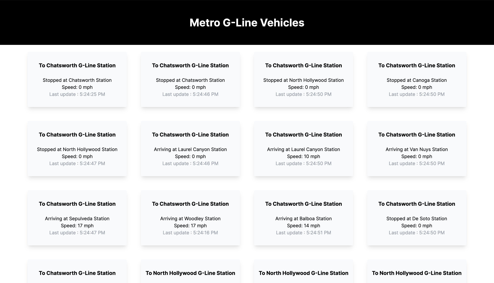

# LA Metro Transportation Viewer

Connects Next.js application to LA Metro API to get current locations of
the G-line buses. These locations are displayed for the user and show the time
of the latest update of the bus’s location.

